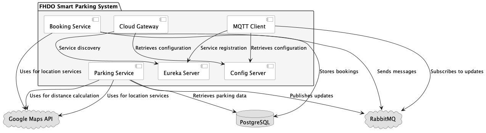

# Implementation and Evaluation of a Smart Parking Application as Mobility-as-a-Service Use Case
# FHDO Smart Parking System

## Overview

The FHDO Smart Parking System is a microservices-based application designed to provide a comprehensive parking management solution. This system includes various services for booking management, configuration, API gateway, service discovery, MQTT messaging, and parking management.

## Services

### 1. Booking Service

**Purpose**: Manages the booking process for parking spaces, including booking confirmation and cancellation.

**Key Features**:
- Handle booking requests.
- Send and receive messages through RabbitMQ for booking confirmation and cancellation.

**Endpoints**:
- `POST /api/bookings` - Create a new booking.
- `DELETE /api/bookings/{bookingId}` - Cancel an existing booking.

### 2. Config Server

**Purpose**: Provides centralized configuration management for all microservices.

**Key Features**:
- Serves configuration properties from a Git repository or other sources.
- Supports dynamic configuration updates.

**Endpoints**:
- `/config/{application}/{profile}` - Access configuration properties.

### 3. Cloud Gateway

**Purpose**: Acts as an API gateway for routing requests to the appropriate microservices.

**Key Features**:
- Route requests to backend services.
- Handle cross-cutting concerns such as security, monitoring, and logging.

**Endpoints**:
- Routes requests based on the service paths defined in its configuration.

### 4. Eureka Server

**Purpose**: Provides service discovery and registration for microservices.

**Key Features**:
- Register microservices so they can be discovered by other services.
- Provide health checks and status information.

**Endpoints**:
- `/eureka/apps` - Access registered services information.

### 5. MQTT Client

**Purpose**: Manages communication with MQTT brokers for real-time messaging.

**Key Features**:
- Publish and subscribe to MQTT topics for real-time updates.

**Endpoints**:
- No direct REST API; interacts through MQTT protocol.

### 6. Parking Service

**Purpose**: Manages parking lots, parking spaces, and provides nearby parking information.

**Key Features**:
- Retrieve available parking spaces.
- Calculate distances and travel times using Google Maps API.
- Geocode addresses to find parking locations.

**Endpoints**:
- `GET /api/parking/nearby` - Find nearby parking based on geolocation or address.
- `GET /api/parking/{parkingId}/spaces` - Retrieve available parking spaces for a specific parking lot.

## Architecture

- **Service Discovery**: Eureka Server
- **API Gateway**: Cloud Gateway
- **Configuration Management**: Config Server
- **Real-time Messaging**: MQTT Client
- **Booking Management**: Booking Service
- **Parking Management**: Parking Service

## Getting Started

### Prerequisites

- Java 11 or later
- Docker (optional, for containerized deployment)
- RabbitMQ (for booking service messaging)
- MQTT Broker (for MQTT Client)

### Running Services

1. **Start Eureka Server**
    - Navigate to the `eureka-server` directory.
    - Run `./mvnw spring-boot:run`.

2. **Start Config Server**
    - Navigate to the `config-server` directory.
    - Run `./mvnw spring-boot:run`.

3. **Start Cloud Gateway**
    - Navigate to the `cloud-gateway` directory.
    - Run `./mvnw spring-boot:run`.

4. **Start MQTT Client**
    - Navigate to the `mqtt-client` directory.
    - Run `./mvnw spring-boot:run`.

5. **Start Parking Service**
    - Navigate to the `parking-service` directory.
    - Run `./mvnw spring-boot:run`.

6. **Start Booking Service**
    - Navigate to the `booking-service` directory.
    - Run `./mvnw spring-boot:run`.

### Configuration

- Update `application.yml` or `application.properties` files in each service with relevant configurations.
- Ensure all services are registered with Eureka Server.
- Configure RabbitMQ and MQTT brokers as needed.

### API Documentation

- Use the Cloud Gateway's API to access various endpoints.
- Swagger or OpenAPI documentation may be available for each service.