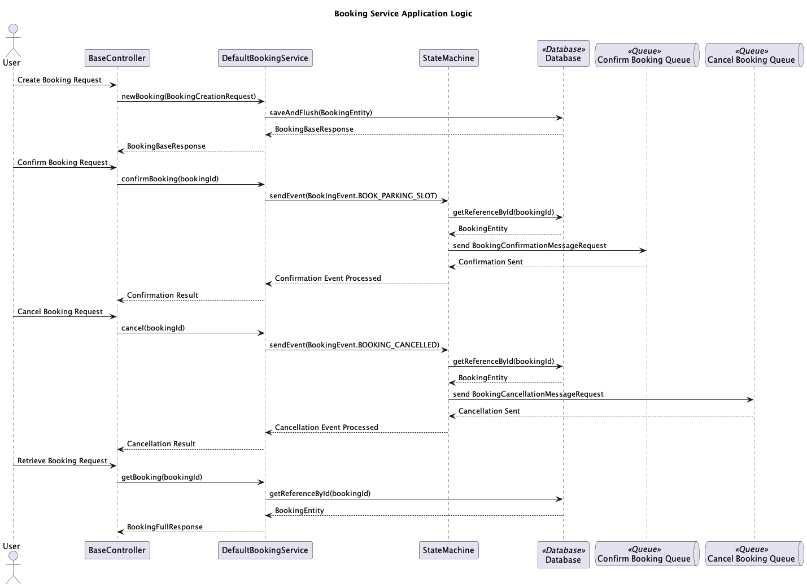
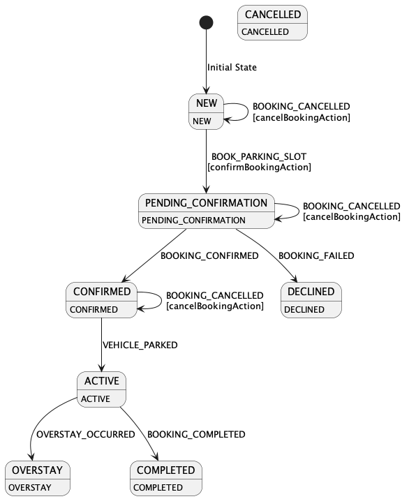

# Booking Service

The Booking Service is a microservice responsible for managing bookings in a parking system. It handles booking
creation, confirmation, cancellation, and retrieval of booking details. This service interacts with various components
such as RabbitMQ for messaging and a state machine for managing booking states.

### Prerequisites

- Java 17
- Maven 3.8.4 or higher
- Docker and Docker Compose

### Building the Application

1. **Clone the Repository**

   ```bash
   git clone https://github.com/your-repository/booking-service.git
   cd booking-service 
   ```
2. **Build the Project**
   ```bash
   mvn clean package
   ```
   This command will compile the code, run tests, and package the application into a JAR file.

### Running the Application

1. **Start the Services**

   The application uses Docker Compose to manage the PostgreSQL database and RabbitMQ broker.

   Ensure you have Docker and Docker Compose installed, then start the services in detached mode using:
   ```bash
   docker-compose up -d
   ```
2. **Running the Application**

   Once the services are up and running, you can start the booking-service application.
   ```bash
   mvn spring-boot:run
   ```

   Alternatively, you can run the JAR file directly:

   ```bash
   java -jar target/booking-service-0.0.1-SNAPSHOT.jar
   ```
Ensure the environment variables for the database connection and RabbitMQ are configured correctly in your application.properties or application.yml file.

## Features

- Create new bookings
- Confirm bookings
- Cancel bookings
- Retrieve booking details
- Delete bookings

## Sequence Diagram


## Configuration

### RabbitMQ Configuration

The service uses RabbitMQ for messaging, with specific queues configured for booking requests and responses.

- **`booking.confirm.request`**: Queue for booking confirmation requests.
- **`order.confirm.response`**: Queue for booking confirmation responses.
- **`booking.cancel.request`**: Queue for booking cancellation requests.
- **`booking.cancel.response`**: Queue for booking cancellation responses.

### State Machine

The service uses a state machine to manage the lifecycle of bookings. The states include:

- `NEW`
- `PENDING_CONFIRMATION`
- `CONFIRMED`
- `DECLINED`
- `CANCELLED`
- `ACTIVE`
- `OVERSTAY`
- `COMPLETED`

Events that trigger state transitions include:

- `BOOK_PARKING_SLOT`
- `BOOKING_CONFIRMED`
- `BOOKING_FAILED`
- `BOOKING_CANCELLED`
- `VEHICLE_PARKED`
- `OVERSTAY_OCCURRED`
- `BOOKING_COMPLETED`


## REST API

### Endpoints

#### Create Booking

- **URL**: `/api/v1/bookings/create`
- **Method**: `POST`
- **Request Body**: `BookingCreationRequest`
- **Response**: `BookingBaseResponse`

#### Confirm Booking

- **URL**: `/api/v1/bookings/{bookingId}/book`
- **Method**: `POST`
- **Path Variable**: `bookingId` (UUID of the booking to confirm)
- **Response**: `void`

#### Cancel Booking

- **URL**: `/api/v1/bookings/{bookingId}/cancel`
- **Method**: `POST`
- **Path Variable**: `bookingId` (UUID of the booking to cancel)
- **Response**: `void`

#### Get Booking

- **URL**: `/api/v1/bookings/{bookingId}`
- **Method**: `GET`
- **Path Variable**: `bookingId` (UUID of the booking to retrieve)
- **Response**: `BookingFullResponse`

#### Delete Booking

- **URL**: `/api/v1/bookings/{bookingId}`
- **Method**: `DELETE`
- **Path Variable**: `bookingId` (UUID of the booking to delete)
- **Response**: `void`

## Components

### State Machine Configuration

- **`BookingStateMachineConfig`**: Configures the state machine, including states, transitions, and actions.

### RabbitMQ Configuration

- **`RabbitMqConfiguration`**: Configures RabbitMQ queues, message converters, and listener container factories.

### Actions

- **`ConfirmBookingAction`**: Handles the action of confirming a booking.
- **`CancelBookingAction`**: Handles the action of canceling a booking.

### Listeners

- **`BookingConfirmationResultListener`**: Listens to booking confirmation responses.
- **`BookingCancellationResultListener`**: Listens to booking cancellation responses.

### Services

- **`BookingService`**: Provides methods for creating, confirming, retrieving, canceling, and deleting bookings.
- **`DefaultBookingService`**: Implementation of `BookingService` and `BookingMessageResponseHandler`.
- **`BookingMessageResponseHandler`**: Interface for processing booking confirmation and cancellation results.
- **`BookingStateChangeInterceptor`**: Intercepts state changes to persist updates in the database.

## Configuration Classes

### `ObjectMapperConfiguration`

Configures the `ObjectMapper` used for JSON serialization and deserialization.

### `LocalDiscovery`

Configures local service discovery for the application when running in a "local-discovery" profile.
