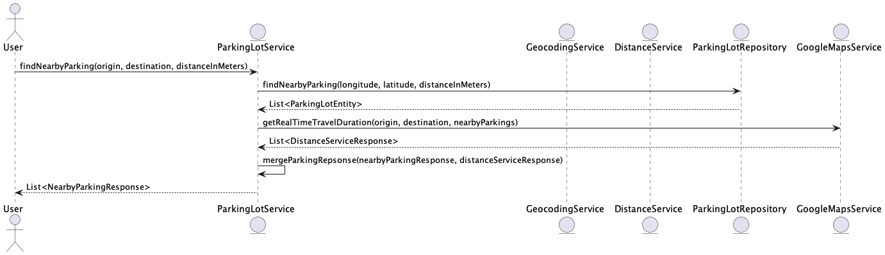

# Parking Service

The `parking-service` is a Spring Boot application designed to manage parking lots and parking spaces. It integrates with PostgreSQL for data storage, uses RabbitMQ for messaging, and connects to external services such as Google Maps.

## Overview

The Parking Service handles operations related to parking lots and parking spaces, including:
- Managing parking lot and space data.
- Handling booking and cancellation requests.
- Integrating with Google Maps for geolocation and distance services.

## Features

- **Data Management**: Stores and retrieves parking lot and parking space information using PostgreSQL.
- **Booking and Cancellation**: Processes booking and cancellation requests.
- **Google Maps Integration**: Uses Google Maps API for geocoding and distance calculations.
- **Messaging**: Uses RabbitMQ for asynchronous communication.
- **Data Migration**: Manages database schema changes with Flyway.

## Running the Application

1. **Start the PostgreSQL Database**: Ensure PostgreSQL is running on `localhost` port `5432` with the database `parking`.
2. **Start RabbitMQ**: Ensure RabbitMQ is running on `localhost` port `5672`.
3. **Build the Project**: Use Maven to build the project:
    ```bash
    ./mvnw clean install
    ```
4. **Run the Application**: Start the Spring Boot application:
    ```bash
    ./mvnw spring-boot:run
    ```
   
## Configuration

### Application Properties

- **Server Port**: Configured to run on port `8083`.
- **Database**:
- **URL**: `jdbc:postgresql://localhost:5432/parking`
- **Username**: `user`
- **Password**: `password`
- **Flyway**:
- **Schemas**: `shared`
- **RabbitMQ**:
- **Host**: `localhost`
- **Port**: `5672`
- **Username**: `user`
- **Password**: `password`
- **JPA**:
- **Ddl Auto**: `none`
- **Naming Strategy**: CamelCase to SnakeCase

## Database Schema

### `V2__parking_table.sql`

This SQL migration script creates the following tables and constraints for the parking service:

- **Tables**:
- **`parking_lot`**: Stores information about parking lots, including location, capacity, and operational hours.
- **`parking_space`**: Stores information about individual parking spaces, including their status and type.

- **Triggers and Functions**:
- **`set_geo_point` Function**: Sets the `geo_point` column based on latitude and longitude.
- **`set_geo_point_trigger` Trigger**: Automatically sets the `geo_point` column before inserting a row into `parking_lot`.

### `ParkingSpaces.sql`

This SQL script generates parking spaces for each parking lot:

- **Function `generate_parking_spaces`**:
- Calculates the number of parking spaces based on the total capacity of a parking lot.
- Inserts parking space records with a unique `internal_id` for each parking lot and assigns a type based on certain criteria.

- **Execution**:
- The script calls `generate_parking_spaces` for each parking lot in the `shared.parking_lot` table.

### `ParkingLot.sql`

This SQL script inserts sample data into the `shared.parking_lot` table:

- **Sample Records**:
- Inserts details for parking lots in Dortmund, including their location, capacity, and operational hours.


## Code Logic

### Application Structure

- **Controllers**: Handle HTTP requests for parking lots and spaces.
- **Services**: Business logic for managing parking data.
- **Repositories**: Data access layers for interacting with the database.
- **Configurations**: Spring and external service configurations.
- **Entities**: JPA entities representing parking lots and spaces.
- **Mappers**: MapStruct mappers for DTO conversions.

### Google Maps Configuration

Configures the `GeoApiContext` bean required for integrating Google Maps API. It sets up the API key, specifies retry and rate limit parameters, and configures a read timeout for API requests.

### Local Discovery

Enables service discovery by annotating the class with `@EnableDiscoveryClient`. This allows the application to register with a service registry, facilitating service discovery and load balancing.

### Object Mapper Configuration

Sets up a custom `ObjectMapper` bean for JSON serialization and deserialization. It includes configurations to handle date formats, empty values, and Java time modules.

### RabbitMQ Configuration

Configures RabbitMQ for message queuing:

- **Queue Definitions**: Defines queues for booking requests and responses.
- **Message Converter**: Uses Jackson JSON converter for message serialization and deserialization.
- **Class Mapper**: Maps message types to their corresponding Java classes for proper message handling.

### Parking Lot and Parking Space Entities

Defines JPA entities for parking lots and parking spaces:

- **ParkingLotEntity**: Represents a parking lot with attributes like address, geolocation, capacity, and hourly rates.
- **ParkingSpaceEntity**: Represents individual parking spaces, including their status and type.

These entities are used to map database records to Java objects, facilitating interaction with the PostgreSQL database.

### Mappers

**`MapStructMapper`**

- **`parkingLotEntityToNearbyParkingResponse`**: Converts a `ParkingLotEntity` to a `NearbyParkingResponse` while ignoring the `isOpen` field.
- **`parkingLotEntityListToNearbyParkingResponseList`**: Converts a list of `ParkingLotEntity` objects to a list of `NearbyParkingResponse` objects.
- **`calculateIsOpen`**: After mapping, calculates whether the parking lot is currently open based on the current time and the parking lot's opening and closing times.

### DTOs (Data Transfer Objects)

**`AvailableParkingSpacesResponse`**

- Represents the response containing the parking ID, total occupancy, counts of available parking spots, and IDs of available spots.

**`DistanceServiceResponse`**

- Contains geolocation data and information on the distance and travel time between the origin and destination.

**`NearbyParkingRequest`**

- Represents a request for nearby parking including origin, destination, address, and search distance.

**`NearbyParkingResponse`**

- Includes details of nearby parking such as place ID, geolocation, full name, address, capacity, hourly rates, distance, travel times, and open status.

**`ParkingSpotCount`**

- Represents the count of available parking spots by type.

**`BookingCancellationMessageRequest`**

- Represents a request to cancel a booking, including booking ID, parking ID, and parking spot ID.

**`BookingCancellationMessageResponse`**

- Represents a response indicating whether the booking was successfully canceled.

**`BookingConfirmationMessageRequest`**

- Represents a request to confirm a booking, including booking ID, user ID, parking ID, spot ID, and booking times.

**`BookingConfirmationResponse`**

- Represents a response indicating whether the booking was successfully confirmed.

**`ParkingLotOnwershipType`**

- Enum for parking lot ownership types (PUBLIC or PRIVATE).

**`ParkingSpotType`**

- Enum for types of parking spots (REGULAR, HANDICAPPED, ELECTRIC_VEHICLE, MOTORCYCLE, VIP).

### Repositories

**`ParkingLotRepository`**

- Interface for managing `ParkingLotEntity` entities with custom methods to find nearby parking.

**`ParkingLotRepositoryExtension`**

- Defines custom query methods, including finding nearby parking lots based on geographical distance.

**`ParkingLotRepositoryImpl`**

- Implements custom query methods for `ParkingLotRepositoryExtension`, utilizing native queries to find nearby parking lots and calculate distances.

**`ParkingSpaceRepository`**

- Interface for managing `ParkingSpaceEntity` entities with methods to get available spaces and find parking spots based on reservation and occupancy status.

### Service Summary

#### DistanceService

**`DistanceService` Interface**

- **`getRealTimeTravelDuration(Geolocation origin, Geolocation destination, List<Geolocation> nearbyParkings)`**: Fetches real-time travel duration and distance from an origin to a destination through a list of nearby parkings.

**`GoogleMapsService` Class**

- Implements `DistanceService` and `GeocodingService` using Google Maps API.
- **`getLocationOfAddress(String address)`**: Retrieves geolocation data for a given address using the Google Geocoding API.
- **`getRealTimeTravelDuration(Geolocation origin, Geolocation destination, List<Geolocation> nearbyParkings)`**: Calculates real-time travel durations and distances using the Google Distance Matrix API.
- **`getDistanceMatrixRow(List<Geolocation> startLocations, List<Geolocation> endLocations, TravelMode mode)`**: Fetches distance matrix data for given start and end locations.
- **`sumDataAndCalculateTotal(List<Geolocation> parkings, DistanceMatrixRow[] carToParkings, DistanceMatrixRow[] parkingsToDestination)`**: Combines results from different API calls to produce comprehensive distance and travel time information.

#### GeocodingService

**`GeocodingService` Interface**

- **`getLocationOfAddress(String address)`**: Obtains the geographical coordinates of a given address.

#### BookingMessageRequestHandler

**`BookingMessageRequestHandler` Class**

- Handles booking confirmation and cancellation requests via RabbitMQ.
- **`processConfirmationRequest(BookingConfirmationMessageRequest request)`**: Processes booking confirmation requests and sends a confirmation response.
- **`processCancellationRequest(BookingCancellationMessageRequest request)`**: Processes booking cancellation requests and sends a cancellation response.

#### ParkingLotService

**`ParkingLotService` Class**

- Provides functionalities for finding and managing parking lots.
- **`findNearbyParking(Geolocation origin, Geolocation destination, double distanceInMeters)`**: Finds nearby parking lots based on origin and destination, calculates travel durations and distances, and merges this data into a sorted list of parking responses.
- **`findNearbyParking(String address, double distanceInMeters)`**: Finds nearby parking lots based on an address after geocoding it.
- **`mergeParkingRepsonse(List<NearbyParkingResponse> nearbyParkingResponse, List<DistanceServiceResponse> distanceServiceResponse)`**: Merges parking lot details with travel data based on geolocation and sorts the results by total trip time.

#### ParkingSpaceService

**`ParkingSpaceService` Class**

- Manages available parking spaces in parking lots.
- **`getAvailableSpaces(String parkingId)`**: Retrieves available parking spots and their counts for a given parking lot ID, including IDs of non-reserved and non-occupied spots.

